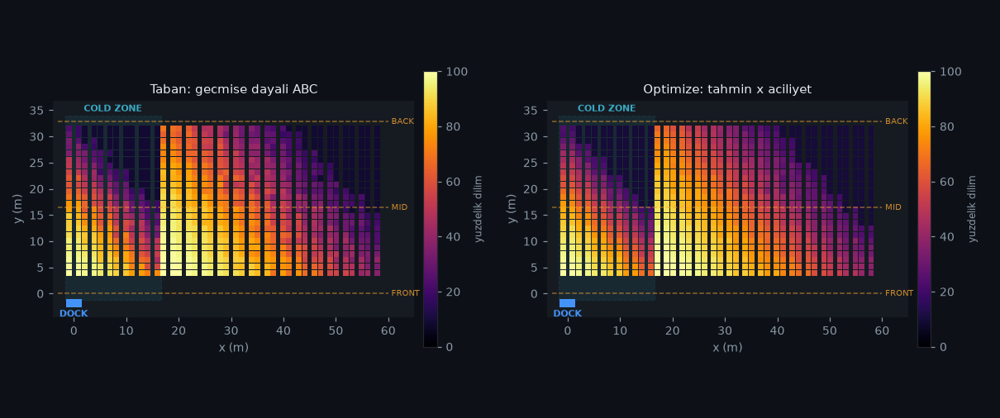
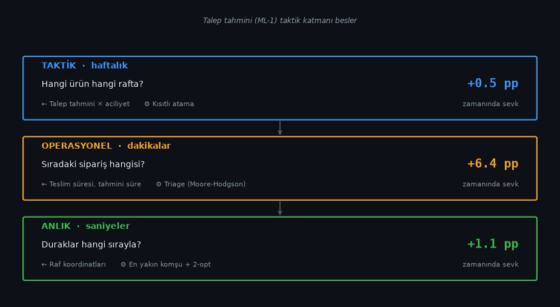

# Warehouse Flow Optimization

Forecast-driven slotting, deadline-aware dispatch and pick routing for a distribution
centre — evaluated end-to-end on a discrete-event simulation, against baselines that
real warehouses actually use.

*[Türkçe açıklama aşağıda](#türkçe)*

---

## Results

Six weeks of simulated operation, five replications, measured against a baseline of ABC
slotting + earliest-due-date dispatch + S-shape routing — what a competent warehouse
already does.

| | Baseline | Optimised | Change |
|---|---|---|---|
| **Orders missing their truck** | 7.00% | **0.56%** | **−92%** |
| On-time rate | 0.9300 | 0.9944 | +6.4 pp |
| Walking distance per pick line | 8.46 m | 8.03 m | −5.1% |
| Mean tardiness | 0.72 h | 0.49 h | −32% |
| 95th-percentile tardiness | 5.31 h | 0.24 h | −95% |

Picker headcount, shift length, truck schedule and demand are identical in both columns.
The entire difference is which order gets picked next, what it is batched with, where the
stock sits, and in what sequence the stops are visited.

### Where the gain comes from

Each component was also run on its own, so the improvement can be attributed rather than
asserted. Intervals are 95% CIs on the *paired* difference — every scenario faced the
identical congestion, picker-skill and truck-delay realisation.

| Scenario | On-time Δ | 95% CI | Distance/line Δ | Misses |
|---|---|---|---|---|
| Slotting only (forecast × urgency) | +0.005 | [−0.001, +0.010] | −0.6% | 6.54% |
| Dispatch only (triage) | **+0.064** | [+0.003, +0.125] | +2.4% | **0.62%** |
| Routing only (savings batching + 2-opt) | +0.011 | [+0.001, +0.021] | **−7.0%** | 5.91% |
| **All three** | **+0.064** | [+0.004, +0.125] | −5.1% | **0.56%** |
| *(+ SLA-risk escalation)* | *+0.054* | *[−0.002, +0.110]* | *−5.1%* | *1.61%* |

Three things worth reading off this table:

**Almost all the deadline benefit is one scheduling rule, and it is not machine learning.**
Triage alone reaches 0.62% misses against the full bundle's 0.56%. `dispatch_study` ranks
the rules directly (misses, relative to EDD):

| Rule | Misses | vs EDD |
|---|---|---|
| FIFO | 9.39% | +390% |
| **EDD** — the baseline | **1.91%** | — |
| Least slack | 3.04% | +59% |
| Least slack + ML pick-time estimate | 3.06% | +60% |
| **Triage** | **0.26%** | **−86%** |

EDD is emphatically not a strawman: it is four times better than FIFO. And least slack —
the natural-looking next step — is a *regression*. It minimises maximum lateness, whereas
the KPI is the number of orders that miss. Among orders due together it starts the longest
one first, trading several small saves for one large one, and it pushes big orders to the
head of the queue where they fill a cart alone and destroy batching. Triage is the online
form of the Moore-Hodgson rule, which is the classical answer for minimising late *counts*:
stop letting orders that can no longer make their deadline block the ones that still can.

**The components trade against each other.** Triage *increases* walking distance by 2.4%,
because prioritising urgency breaks up batches — orders per tour fall from 5.2 to 3.9.
Routing hands that back. Neither component's number means much without the other's.

**Slotting is the weakest lever here.** Its distance saving is real but tiny (−0.6%, and
the interval does exclude zero), while its on-time interval crosses zero — meaning the
data cannot distinguish it from no effect at all. The honest reading is that against a
strong ABC baseline, and with a demand forecast only 12% better than a naive rule, there
is not much left to win by moving stock around.

### What did not work

Two of the three models do not earn their place, and both are kept in the repository with
the evidence rather than quietly dropped.

**ML-2, pick-time prediction.** A linear regression fitted to observed tours (MAE 183.1 s)
matches gradient boosting (183.8 s). Pick time really is close to linear in lines, units
and distance. Downstream it matters even less: swapping the analytic estimate for the
model leaves the dispatch policy's on-time rate unchanged to four decimal places, because
both produce the same *ordering* of the queue.

**ML-3, SLA-risk escalation.** Adding it on top of the optimised bundle makes things
worse — 1.61% misses against 0.56% — at every escalation threshold tried, from 0.2 to 0.8
(`python -m src.experiments.dispatch_study`). The metrics say why, but only if you read
all of them:

| | Pooled AUC | Within-decision AUC | Average precision | Brier |
|---|---|---|---|---|
| Rank by slack | 0.847 | 0.624 | **0.254** | **0.030** |
| LightGBM | 0.782 | **0.818** | 0.070 | 0.097 |

The model is much better at ranking the orders competing inside a single decision — the
question a dispatcher actually asks. But its average precision is a third of slack's and
it is badly calibrated, meaning it orders the *bulk* of the queue well while being
unreliable at the very top. An escalation policy spends nothing but the top, so it
promotes the wrong orders.

No single offline metric caught this. Pooled AUC and within-decision AUC point in opposite
directions, and which one matters is decided by how the score is used rather than by
convention. The end-to-end simulation settled it.

### Structural finding: when routing optimisation is worth anything

With a **single** cross aisle, a tour's cost is

```
total = 2 × Σ(y over stops)  +  (a one-dimensional traversal in x)
```

The first term is independent of the visiting order — every stop must be entered and
exited from the same end — and the second is already minimised by sorting on aisle, which
is exactly what S-shape does. **No routing heuristic can win.** Measured gain: 0.0%, not
approximately.

| Cross aisles | S-shape | NN + 2-opt | Gain |
|---|---|---|---|
| 1 | 820.3 m | 820.3 m | **0.0%** |
| 2 | 580.3 m | 515.2 m | 11.2% |
| **3** (this warehouse) | 456.3 m | 384.3 m | **15.8%** |
| 4 | 412.9 m | 323.5 m | 21.7% |

This determined the warehouse design rather than the other way round: real distribution
centres have front, middle and back cross aisles, and that is precisely why routing
heuristics pay off in them. The zero-gain case is pinned down by a test, because a
non-zero result there would mean the distance model was broken.

### Robustness

Under stress the models, the forecast and the slot assignment stay exactly as fitted under
normal conditions — nothing is refitted, which is what a deployed system faces.

| Condition | Baseline | Optimised | Δ on-time | 95% CI |
|---|---|---|---|---|
| Normal | 0.930 | 0.994 | +0.064 | [+0.004, +0.125] |
| Demand surge (+40%) | **0.001** | 0.964 | +0.963 | [+0.952, +0.974] |
| Heavy truck delays (×2.5) | 0.935 | 0.995 | +0.060 | [+0.003, +0.116] |
| Picker shortage (4 → 3) | **0.023** | 0.959 | +0.936 | [+0.899, +0.973] |

All four intervals exclude zero. The two extreme rows are the point of the exercise: under
a 40% demand surge, or with a quarter of the workforce missing, the baseline does not
degrade gracefully — it **collapses**, to under 3% on-time with mean tardiness measured in
days, while the optimised policy holds above 95%.

That is the practical argument for this work. Near capacity, the difference between a good
scheduling rule and a merely reasonable one is not a few percentage points of service
level; it is whether the operation still functions when something goes wrong. And nothing
was retuned for these conditions — the same triage rule that was worth 6 points on a normal
week is worth 94 on a bad one.

### The number a warehouse manager would ask for

Sweeping the arrival rate makes the same point in the form an operation can actually act
on. On-time rate, same four pickers throughout:

| Orders/day | Baseline | Optimised |
|---|---|---|
| 150 | 1.000 | 0.999 |
| 175 | 0.999 | 0.999 |
| 200 | 0.981 | 0.998 |
| 225 | 0.610 | 0.986 |
| 250 | 0.487 | 0.986 |
| 275 | **0.000** | 0.963 |

The baseline falls off a cliff between 200 and 225 orders/day. The optimised policy is
still above 96% at 275.

> **Holding a 95% service level, the baseline caps out at 200 orders/day and the optimised
> policy reaches 275 — 37% more throughput from the same building and the same headcount.**

Read the vertical gap and this is a service-level improvement; read the horizontal gap and
it is a capacity one. The second framing is the one that has a budget attached.

Two notes so the numbers can be reconciled. The sweep uses two replications per point
rather than five, so its levels are noisier — the baseline reads 0.981 at 200 orders/day
here against the 0.930 five-replication mean in the headline table, because the two draws
it happened to use were kinder than the full five. The ordering is unaffected. And the
operating point used everywhere else, 200 orders/day, is exactly the baseline's own 95%
ceiling: the comparison is run at the hardest load the baseline can still claim to handle,
not at one chosen to flatter the alternative.

---

### Where the demand sits



Each rectangle is one rack column, coloured by the percentile rank of how often the SKU
stored there was picked. Raw pick counts follow a Zipf law and flatten a linear scale into
a single swatch, so the colour is on rank instead.

Two things are worth reading off it. The heat concentrates near the front cross aisle,
which is what a working slotting policy looks like. And the chilled zone — the shaded band
on the left, physically the closest storage to the dock — is noticeably *cooler* than the
ambient aisles beside it. That is the exclusivity constraint biting: only cold SKUs may
use those slots, they face less competition for them (78% occupancy against 87% ambient),
and so the single best piece of real estate in the building is spent on moderately popular
chilled stock. Nothing in the model was told to do that; it fell out of a layout decision.

### What is optimized, where



## What problem this solves

Getting a product out of the building is not one job. It is two decisions, made on
different time scales, from different data, by different people.

**1 · Placement — decided at goods-in, paid for over weeks.**
A pallet arrives. Does it go in a slot near the shipping ramp or far from it? A slot has
exactly one cost, its walking distance from the dock; a product has exactly one value,
how many times it will make someone walk that distance. The rule multiplies the two:

```
score = expected picks × (1 + β × same-day share)
```

and the highest-scoring product takes the nearest slot it is *permitted* to occupy —
permission being the chilled-zone and ground-level constraints. The expected picks come
from the demand forecast, so this is where the ML feeds the optimization. This is a
constrained assignment problem, and it is solved once a week.

**2 · Evacuation — decided when the vehicle is at the door, over in minutes.**
Which order is picked next, batched with what, routed how — and then, once it is standing
on the staging lanes, how does it actually get onto the truck? Three stages, each limited
by a different resource: pickers, staging capacity, and the loading crew against the time
left before departure. This is online scheduling.

### The two halves are measured separately

An order can miss its truck for two quite different reasons: it was **not picked in
time**, or it was **ready and the crew never got to it**. The simulation attributes every
miss to one side or the other, which turns an argument into a number — and that number
says which half is worth investing in. It also sets a ceiling: no amount of picking,
batching or routing optimisation can recover a miss caused by loading.

### What joins them: wave release

An order is not released for picking until its truck is within `release_horizon_h`. This
is not decoration. Without it pickers run ahead on orders whose truck leaves tomorrow,
fill the staging lanes, and then block *themselves* out of the work for the vehicle
actually at the door — the simulation deadlocks outright, every picker queued behind a
staging area full of stock nobody can load yet. The horizon was swept: at 8 hours service
collapses because all the work bunches before each departure, and at 36 hours orders sit
on the lanes for 16 hours, which is using the dock as a warehouse.

## Approach

Machine learning where a prediction is genuinely needed, classical optimization where the
decision has structure worth exploiting. Concretely:

| Half | Horizon | Decision | Method |
|---|---|---|---|
| **Placement** | weekly | which SKU goes in which slot | constrained assignment, weighted by forecast demand and urgency |
| **Evacuation** | minutes | which order is picked next, batched with what | due-date scheduling with triage |
| **Evacuation** | seconds | sequence of stops in a tour | nearest neighbour + 2-opt |
| **Evacuation** | at the door | what goes on the deck when it will not all fit | triage again — save what is still savable |

Reinforcement learning was considered and rejected. It photographs well and defends
badly: the state space here is enormous, the reward is sparse and delayed, and the
resulting policy is almost impossible to explain to the operations manager who has to
sign off on it. The methods above are auditable, and each one can be argued for on its
own terms.

## The data

The warehouse geometry is synthetic — no public dataset contains real slot layouts, and
nothing would be gained by pretending otherwise. The **demand** side is not invented: it
is calibrated from the [UCI Online Retail II](https://archive.ics.uci.edu/dataset/502/online+retail+ii)
dataset, roughly a million real invoice lines from a UK wholesaler over two years.

`python -m src.calibration.fit_parameters` downloads it, cleans it, and estimates:

| Parameter | Feeds |
|---|---|
| Popularity distribution across SKUs | how skewed demand is — the reason slotting matters at all |
| Lines per order | tour length, and therefore routing |
| Units per line | handling time |
| Weekday and month multipliers | the seasonality the forecast model has to learn |

Two patterns that came out of the real data and would not have been guessed:

- **Saturday nearly stops** (multiplier ≈ 0.32). This is a wholesaler, not a shop.
- **The peak is November, not December** (1.57 vs 1.16). It supplies retailers, so its own
  peak lands a month or two before theirs — stock has to reach the shelves *before*
  Christmas, not during it.

Cleaning is audited rather than assumed: every rule reports how many rows it removed, in
`reports/` and in notebook 1. Cancellations and exact duplicates dominate. Nothing is
dropped for being an outlier in demand — a huge wholesale order is exactly the kind of
event a warehouse has to survive.

If the download is unavailable the pipeline still runs on documented parametric defaults
and records `source: fallback`, so no report ever silently misrepresents where its numbers
came from.

## The simulation

A SimPy discrete-event model of a mid-size DC: 20 aisles × 24 bays × 2 rack faces ×
3 levels = 2,880 slots, 2,400 SKUs (about 83% occupancy, so slots are genuinely
contested), three cross aisles, four outbound trucks a day, four pickers on a 17-hour
shift.

**Deadlines are not invented numbers.** Each order is assigned to a departing truck, and

```
deadline = planned departure − staging buffer
```

Trucks then arrive early, on time or late from a right-skewed delay distribution and queue
for a limited number of dock doors. A late truck quietly relaxes its orders; an early one
tightens them; an order that misses its truck rolls to the next departure and is counted
late against the promise it was given.

### The operating point is deliberate

The warehouse runs near 85% picker utilisation and misses a few percent of its promises.
That is chosen, not accidental. Below it every policy scores 100% and the comparison is
vacuous; above it the queue tips over — the transition is sharp, as queueing systems near
capacity always are, and `reports/load_curve.csv` traces it. Real warehouses live on
exactly this cliff edge, which is why scheduling them well is worth anything at all.

It is also why the baseline's own results scatter so widely between replications: at this
load, whether a given six weeks goes well depends heavily on which congestion and truck
delay realisation it happened to draw.

### Two KPIs, kept separate

`on_time` asks whether an order left on the truck it was promised — the warehouse's own
performance, the part pickers control. `tardiness` measures lateness against the promised
departure *clock*, which includes the carrier's own delay. An order can be on time and
still carry tardiness, because it caught the right truck and that truck left the yard
late. Collapsing the two would either blame the warehouse for carrier delays or hide them.

## Honest evaluation

The single biggest risk in a simulation-based project is that the author's own generator
becomes a self-fulfilling prophecy. Five defences:

**Real calibration.** The demand distributions are estimated, not chosen.

**Hidden factors.** The simulator's timing uses instantaneous congestion, per-picker skill
and residual noise, none of which is ever exposed as a model feature. Irreducible error is
built in, so no model can score suspiciously well by rediscovering the generator.

**Mechanically tested leakage.** Rather than trusting the feature code to be
look-ahead-free, the test suite perturbs the target on one day and asserts that no feature
for that day moves. Another test asserts the simulator's true popularity parameter never
reaches the model.

**Baselines that are not strawmen.** ABC slotting on trailing demand, earliest-due-date
dispatch, and S-shape routing are what competent warehouses do. Beating a random layout
would prove nothing.

**Common random numbers.** Congestion, picker skill and truck delays are drawn before the
run from a stream that does not depend on the policy, and every scenario replays the same
draws. Run-to-run variation in the baseline is large — on-time rate swings between about
92% and 99% depending only on which congestion and delay realisation a replication drew.
Without pairing, that noise would swamp the effect entirely.

## Repository layout

```
config.py                    every tunable parameter, in one file
src/calibration/             download, clean and fit parameters from real data
src/simulation/              warehouse, catalog, orders, trucks, SimPy engine
src/features/                demand features (leakage-free by construction)
src/models/                  ML-1 demand, ML-2 pick time, ML-3 SLA risk
src/policies/                slotting (placement); dispatch, batching, routing (evacuation)
src/experiments/             comparison, ablation, dispatch study, stress tests, load curve
notebooks/                   calibration + EDA, then models + results
app/dashboard.py             Streamlit demo, Turkish and English
app/theme.py                 palette, CSS, and the one place the building is drawn
app/svg_map.py               animated floor plan for the order journey
app/i18n.py                  TR/EN string table
tests/                       geometry, optimality, leakage, simulation invariants
data/sample/                 committed extracts so the data is visible without running anything
reports/                     result tables, committed so the numbers can be checked
```

## Running it

```bash
python -m venv .venv && .venv/Scripts/activate   # source .venv/bin/activate on Unix
pip install -r requirements.txt
```

```bash
python -m src.calibration.fit_parameters    # download + clean + calibrate (~2 min)
python -m src.simulation.generate           # build all datasets (~5 s)
python -m src.models.evaluate               # three models vs their baselines
python -m src.experiments.run_comparison    # scenario comparison + ablation
python -m src.experiments.dispatch_study    # why the obvious dispatch upgrades fail
python -m src.experiments.stress_test       # does the gain survive abnormal conditions
python -m src.experiments.load_curve        # where the warehouse tips over
pytest tests/                               # geometry, optimality, leakage, invariants
streamlit run app/dashboard.py              # interactive demo
```

Everything is seeded from `config.py`, so two people running these commands get identical
numbers.

## Limitations

Stated plainly, because a project that lists none has not looked:

- **Single-deep storage, one slot per SKU.** No replenishment from reserve to pick face,
  and no capacity spillover when a fast mover outgrows its location.
- **Slotting is decided once**, at the start of the measured period. Rolling re-slotting
  would need the picker time that relocating stock consumes to be modelled too; counting
  the benefit without the cost would overstate the gain.
- **Putaway uses its own crew** and does not compete with pickers for labour. Real
  warehouses often share, which would couple inbound and outbound in ways this does not.
- **One dock area, no zone picking, no wave planning.**
- **Cross aisles cost no storage.** The middle cross aisle gives the picker the travel
  shortcut a real corridor would, without consuming the bays it would physically occupy.
  Since the routing gain is measured against an S-shape baseline *in the same layout*, the
  comparison is unaffected — but the absolute slot count is optimistic by roughly one
  bay-row per cross aisle.
- **The demand calibration is one retailer's**, with a pronounced wholesale character —
  25 lines per order is high, and a consumer e-commerce operation would look different.

## Future work

Multi-block layouts with zone picking; replenishment as a first-class decision;
relocation-aware rolling re-slotting; and — with the caveats above understood — comparing
the triage rule against a learned dispatch policy, where the honest baseline is now a
genuinely strong one.

---

<a name="türkçe"></a>

## Türkçe

### Sonuçlar

Altı haftalık simüle operasyon, beş replikasyon. Karşılaştırma tabanı: ABC yerleştirme +
EDD sevkiyat + S-shape rota — yani yetkin bir deponun zaten yaptığı şey.

| | Baseline | Optimize | Değişim |
|---|---|---|---|
| **Kamyonunu kaçıran sipariş** | %7,00 | **%0,56** | **−%92** |
| Zamanında sevk oranı | 0,9300 | 0,9944 | +6,4 puan |
| Toplama satırı başına yürüme | 8,46 m | 8,03 m | −%5,1 |
| Ortalama gecikme | 0,72 sa | 0,49 sa | −%32 |
| p95 gecikme | 5,31 sa | 0,24 sa | −%95 |

Toplayıcı sayısı, vardiya, tır programı ve talep iki sütunda da **aynı**. Bütün fark;
hangi siparişin sıradaki olduğu, neyle gruplandığı, stoğun nerede durduğu ve durakların
hangi sırayla gezildiği.

### Kazanç nereden geliyor

| Senaryo | Zamanında Δ | %95 GA | Mesafe/satır Δ | Kaçırma |
|---|---|---|---|---|
| Sadece yerleştirme | +0,005 | [−0,001, +0,010] | −%0,6 | %6,54 |
| Sadece sevkiyat (triage) | **+0,064** | [+0,003, +0,125] | +%2,4 | **%0,62** |
| Sadece rota | +0,011 | [+0,001, +0,021] | **−%7,0** | %5,91 |
| **Üçü birlikte** | **+0,064** | [+0,004, +0,125] | −%5,1 | **%0,56** |
| *(+ SLA risk eskalasyonu)* | *+0,054* | *[−0,002, +0,110]* | *−%5,1* | *%1,61* |

Bu tablodan okunacak üç şey var:

**Teslim süresi kazancının neredeyse tamamı tek bir çizelgeleme kuralından geliyor ve o
kural makine öğrenmesi değil.** Triage tek başına kaçırmayı %7,00'den %0,62'ye indiriyor.
`dispatch_study` kuralları doğrudan sıralıyor (EDD tabanına göre kaçırma):

| Kural | Kaçırma | EDD'ye göre |
|---|---|---|
| FIFO | %9,39 | +%390 |
| **EDD** — baseline | **%1,91** | — |
| Least slack | %3,04 | +%59 |
| Least slack + ML süre tahmini | %3,06 | +%60 |
| **Triage** | **%0,26** | **−%86** |

EDD kesinlikle bir korkuluk değil: FIFO'dan dört kat iyi. Ve doğal görünen bir sonraki
adım olan least-slack bir **gerileme**. Sebebi şu: least-slack *maksimum gecikmeyi*
azaltır, oysa KPI geç kalan sipariş **sayısı**. Aynı anda teslim edilecek işler arasında en
uzun olanı öne alır — birkaç küçük kurtarışı bir büyüğüne feda eder — ve büyük siparişleri
kuyruğun başına taşıyarak arabayı tek başına doldurup gruplamayı bozar. Triage ise geç iş
sayısını azaltmanın klasik cevabı olan Moore-Hodgson kuralının çevrimiçi biçimi: artık
teslim süresini tutturamayacak siparişlerin, hâlâ tutturabilecek olanları engellemesine
izin verme.

**Bileşenler birbiriyle takas ilişkisinde.** Triage yürüme mesafesini %2,4 *artırıyor*,
çünkü aciliyeti önceliklendirmek grupları bozuyor (tur başına sipariş 5,2'den 3,9'a
iniyor). Rota optimizasyonu bunu geri veriyor. Hiçbir bileşenin sayısı diğeri olmadan tek
başına anlamlı değil.

**En zayıf kaldıraç yerleştirme.** Mesafe kazancı gerçek ama çok küçük (−%0,6; bu aralık
sıfırı kesmiyor), buna karşılık zamanında sevk aralığı sıfırı kesiyor — yani veri, bunu
"hiç etki yok"tan ayırt edemiyor. Dürüst okuma şu: güçlü bir ABC tabanına karşı ve naif
kurallardan yalnızca %12 iyi bir talep tahminiyle, stoğu yeniden konumlandırarak
kazanılacak fazla bir şey kalmıyor.

### İşe yaramayanlar

Üç modelden ikisi yerini hak etmiyor, ve ikisi de kanıtıyla birlikte repoda duruyor.

**ML-2 (toplama süresi):** Gözlenen turlara uydurulmuş doğrusal regresyon (MAE 183,1 sn)
gradient boosting'e (183,8 sn) eşit. Toplama süresi gerçekten satır, adet ve mesafede
neredeyse doğrusal. Aşağı akışta hiç fark etmiyor: analitik tahmini modelle değiştirmek
sevkiyat politikasının zamanında sevk oranını **dört ondalık basamağa kadar** değiştirmiyor,
çünkü ikisi de kuyruğu aynı sırayla diziyor.

**ML-3 (SLA risk eskalasyonu):** Optimize pakete eklendiğinde sonucu **kötüleştiriyor** —
kaçırma %0,56 yerine %1,61 — ve bu denenen bütün eskalasyon eşiklerinde (0,2–0,8) geçerli.
Metrikler nedenini söylüyor, ama ancak hepsi birlikte okunursa:

| | Havuzlanmış AUC | Karar-içi AUC | Average precision | Brier |
|---|---|---|---|---|
| Slack ile sıralama | 0,847 | 0,624 | **0,254** | **0,030** |
| LightGBM | 0,782 | **0,818** | 0,070 | 0,097 |

Model, tek bir karar anında yarışan siparişleri sıralamada belirgin biçimde daha iyi — ki
bir sevkiyatçının sorduğu soru tam da budur. Ama average precision'ı slack'in üçte biri ve
kalibrasyonu kötü: kuyruğun *gövdesini* iyi sıralarken **tepesinde** güvenilmez. Eskalasyon
politikası ise tepeden başka hiçbir şey harcamaz, dolayısıyla yanlış siparişleri öne alıyor.

Bunu hiçbir çevrimdışı metrik tek başına yakalayamadı; iki AUC birbirinin tersini söylüyor.
Hangisinin önemli olduğuna gelenek değil, skorun nasıl kullanıldığı karar veriyor. Meseleyi
uçtan uca simülasyon çözdü.

### Yapısal bulgu: rota optimizasyonu ne zaman değerli

Tek çapraz koridorda bir turun maliyeti şuna ayrışıyor:

```
toplam = 2 × Σ(durakların y'si)  +  (x ekseninde tek boyutlu tur)
```

İlk terim ziyaret sırasından **tamamen bağımsız** — her durağa aynı uçtan girilip aynı
uçtan çıkılır — ikincisi ise zaten koridora göre sıralamakla optimal çözülür, ki S-shape'in
yaptığı tam olarak budur. **Hiçbir rota sezgiseli kazanamaz.** Ölçülen kazanç: yaklaşık
değil, tam olarak %0,0.

| Çapraz koridor | S-shape | NN + 2-opt | Kazanç |
|---|---|---|---|
| 1 | 820,3 m | 820,3 m | **%0,0** |
| 2 | 580,3 m | 515,2 m | %11,2 |
| **3** (bu depo) | 456,3 m | 384,3 m | **%15,8** |
| 4 | 412,9 m | 323,5 m | %21,7 |

Bu bulgu depo tasarımını belirledi, tersi değil: gerçek dağıtım merkezlerinde ön, orta ve
arka çapraz koridorlar vardır ve rota sezgisellerinin orada işe yaramasının sebebi tam
olarak budur. Sıfır kazanç durumu bir testle sabitlendi, çünkü orada sıfırdan farklı bir
sonuç mesafe modelinin bozuk olduğu anlamına gelir.

### Dayanıklılık

Stres altında modeller, tahmin ve slot ataması **normal koşullarda eğitildiği gibi
kalıyor** — hiçbiri yeniden eğitilmiyor. Sahaya alınmış bir sistemin karşılaştığı durum da
budur.

| Koşul | Baseline | Optimize | Δ zamanında | %95 GA |
|---|---|---|---|---|
| Normal | 0,930 | 0,994 | +0,064 | [+0,004, +0,125] |
| Talep patlaması (+%40) | **0,001** | 0,964 | +0,963 | [+0,952, +0,974] |
| Ağır tır gecikmesi (×2,5) | 0,935 | 0,995 | +0,060 | [+0,003, +0,116] |
| Personel eksikliği (4 → 3) | **0,023** | 0,959 | +0,936 | [+0,899, +0,973] |

Dört aralığın dördü de sıfırı dışarıda bırakıyor. İki uç satır bu testin asıl amacını
gösteriyor: talep %40 arttığında ya da iş gücünün dörtte biri eksildiğinde baseline
kademeli bozulmuyor, **çöküyor** — zamanında sevk %3'ün altına iniyor ve ortalama gecikme
günlerle ölçülüyor — optimize politika ise %95'in üzerinde tutunuyor.

Bu çalışmanın pratik gerekçesi budur. Kapasiteye yakın çalışırken iyi bir çizelgeleme
kuralıyla makul bir kural arasındaki fark birkaç puanlık servis seviyesi değil, bir şeyler
ters gittiğinde operasyonun ayakta kalıp kalmadığıdır. Üstelik bu koşullar için hiçbir şey
yeniden ayarlanmadı: normal bir haftada 6 puan değerinde olan aynı triage kuralı, kötü bir
haftada 94 puan değerinde.

### Bir depo müdürünün soracağı sayı

Sipariş geliş hızını taramak aynı noktayı operasyonun eyleme dökebileceği biçimde
gösteriyor. Zamanında sevk oranı, boyunca aynı dört toplayıcı:

| Sipariş/gün | Baseline | Optimize |
|---|---|---|
| 150 | 1,000 | 0,999 |
| 175 | 0,999 | 0,999 |
| 200 | 0,981 | 0,998 |
| 225 | 0,610 | 0,986 |
| 250 | 0,487 | 0,986 |
| 275 | **0,000** | 0,963 |

Baseline günde 200 ile 225 sipariş arasında uçurumdan düşüyor. Optimize politika 275'te
hâlâ %96'nın üzerinde.

> **%95 servis seviyesini koruyarak baseline günde 200 siparişte tıkanıyor, optimize
> politika 275'e ulaşıyor — aynı binadan ve aynı personelden %37 daha fazla kapasite.**

Tablodaki dikey farkı okursanız bu bir servis seviyesi iyileştirmesi; yatay farkı
okursanız bir kapasite iyileştirmesi. Bütçesi olan çerçeve ikincisidir.

Sayıların birbiriyle uyuşması için iki not. Tarama nokta başına beş yerine iki replikasyon
kullanıyor, dolayısıyla seviyeleri daha gürültülü: burada baseline 200 sipariş/günde 0,981
okunuyor, manşet tablodaki beş replikasyonluk ortalama ise 0,930 — çünkü taramanın denk
geldiği iki çekiliş, beşin tamamından daha iyimserdi. Sıralama bundan etkilenmiyor. İkincisi,
diğer her yerde kullanılan çalışma noktası olan günde 200 sipariş, tam olarak baseline'ın
kendi %95 tavanı: karşılaştırma, baseline'ın hâlâ başa çıkabildiğini iddia edebileceği en
zor yükte yapılıyor, alternatifi parlatacak biçimde seçilmiş bir noktada değil.

### Problem: sevkiyat tek bir iş değil, iki ayrı problem

Bir ürünün depodan çıkması iki farklı kararın sonucudur; ikisi farklı zaman ölçeğinde,
farklı verilerle, farklı kişiler tarafından verilir.

**1 · Yerleştirme — mal girişinde verilir, haftalarca bedeli ödenir.**
Palet geldi: rampaya yakın bir göze mi konacak, uzağa mı? Bir raf gözünün tek bir maliyeti
vardır (dock'a yürüme mesafesi), bir ürünün tek bir değeri vardır (o mesafeyi kaç kez
yürüteceği). Kural bu ikisini çarpar:

```
skor = beklenen toplama sayısı × (1 + β × aynı-gün payı)
```

ve en yüksek skorlu ürün, kullanmasına **izin verilen** en yakın gözü alır — izin, soğuk
zincir ve zemin kat kısıtlarıdır. Beklenen toplama sayısı talep tahmininden gelir; yani
makine öğrenmesinin optimizasyonu beslediği yer burasıdır. Kısıtlı bir atama problemidir
ve haftada bir çözülür.

**2 · Tahliye — araç kapıdayken verilir, dakikalar içinde biter.**
Hangi sipariş önce toplanacak, neyle gruplanacak, hangi rotayla gezilecek — ve hazırlama
alanında bekleyen mal araca nasıl yüklenecek? Üç aşama, her biri farklı bir kaynakla
sınırlı: toplayıcılar, alan kapasitesi, ve kalkışa kalan süreye karşı yükleme ekibi.
Çevrimiçi bir çizelgeleme problemidir.

### İki yarı ayrı ayrı ölçülüyor

Bir sipariş kamyonunu iki farklı sebeple kaçırabilir: ya **zamanında toplanamamıştır**, ya
da **hazır olduğu hâlde ekip ona sıra getirememiştir**. Simülasyon her kaçırmayı bu iki
taraftan birine yazar; böylece tartışma bir sayıya dönüşür ve o sayı hangi yarıya yatırım
yapılacağını söyler. Aynı zamanda bir tavan koyar: yükleme kaynaklı bir kaçırmayı hiçbir
toplama, gruplama veya rota optimizasyonu geri kazanamaz.

### İkisini birbirine bağlayan kural: dalga bırakma

Bir sipariş, kamyonu `release_horizon_h` saatten yakın olana kadar toplamaya açılmaz. Bu
süs değil: bu kural olmadan toplayıcılar yarın kalkacak kamyonun işini önden toplar,
hazırlama alanını doldurur ve **kendilerini** kapıdaki araca ait işten kilitler —
simülasyon tamamen kilitleniyor, her toplayıcı henüz yüklenemeyecek malla dolu bir alanın
arkasında kuyruğa giriyor. Pencere taranarak seçildi: 8 saatte iş teslim anına sıkışıp
servis çöküyor, 36 saatte ise siparişler alanda 16 saat bekliyor ki bu da dock'u depo
olarak kullanmak demek.

### Yaklaşım

Gerçekten tahmin gereken yerde makine öğrenmesi, kararın yapısı olan yerde klasik
optimizasyon. Pekiştirmeli öğrenme değerlendirildi ve elendi: durum uzayı çok büyük, ödül
seyrek ve gecikmeli, ve ortaya çıkan politikayı onaylayacak operasyon müdürüne açıklamak
neredeyse imkânsız. Buradaki yöntemlerin her biri denetlenebilir ve tek tek savunulabilir.

### Veri

Depo geometrisi sentetik — gerçek raf yerleşimi içeren açık bir veri seti yok ve aksini
iddia etmenin bir faydası olmaz. Ama **talep tarafı uydurma değil**: yaklaşık bir milyon
gerçek fatura satırından (UCI Online Retail II, iki yıllık bir İngiliz toptancısı) kalibre
ediliyor — ürün popülerliğinin çarpıklığı, sipariş başına kalem sayısı, kalem başına adet,
ve mevsimsellik.

Gerçek veriden çıkan ve tahmin edilemeyecek iki örüntü:

- **Cumartesi neredeyse duruyor** (katsayı ≈ 0,32). Burası bir mağaza değil, toptancı.
- **Zirve Aralık değil Kasım** (1,57 / 1,16). Perakendeciye mal veriyor, dolayısıyla kendi
  zirvesi onlarınkinden bir-iki ay önce geliyor: mal Noel'de değil, Noel'den *önce* rafta
  olmalı.

Temizlik denetlenebilir: her kural kaç satır çıkardığını raporluyor. Talebi "aykırı" diye
hiçbir şey silinmiyor — devasa bir toptan siparişi, deponun tam da başa çıkmak zorunda
olduğu türden bir olay.

### Simülasyon

SimPy ile kesikli olay simülasyonu: 20 koridor × 24 göz × 3 kat = 2.880 slot, 2.400 SKU,
üç çapraz koridor, günde dört çıkış tırı, 17 saatlik vardiyada dört toplayıcı.

**Teslim süreleri uydurma sayılar değil**, tır programından türetiliyor:
`son an = planlanan kalkış − hazırlık tamponu`. Tırlar sağa çarpık bir dağılımla erken,
zamanında veya geç geliyor ve sınırlı sayıda kapı için kuyruğa giriyor. Geciken tır kendi
siparişlerini rahatlatıyor, erken gelen sıkıştırıyor; kamyonunu kaçıran sipariş bir sonraki
sefere kayıyor ve **kendisine verilen söze göre** geç sayılıyor.

**Çalışma noktası bilinçli seçildi:** yaklaşık %85 toplayıcı doluluğu ve birkaç yüzde
sözün kaçırılması. Bunun altında her politika %100 alır ve karşılaştırma anlamsızlaşır;
hemen üstünde kuyruk çöker (günde 225 siparişte zamanında sevk %28'e iner). Gerçek depolar
tam bu uçurumun kenarında çalışır — çizelgelemenin değerli olmasının sebebi de budur.

**İki KPI ayrı tutuluyor.** `on_time`, siparişin *söz verilen kamyona* yetişip yetişmediği
— deponun kontrol ettiği kısım. `tardiness` ise vaat edilen kalkış saatine göre gecikme,
ki buna taşıyıcının kendi gecikmesi de dahil. Bir sipariş doğru kamyona yetişip yine de
gecikme taşıyabilir. İkisini birleştirmek ya depoyu taşıyıcının hatasıyla suçlar ya da
gecikmeyi gizler.

### Dürüst değerlendirme

Simülasyona dayalı bir projede en büyük risk, yazarın kendi üreticisinin kendi kendini
doğrulayan bir kehanete dönüşmesidir. Beş savunma:

- **Gerçek kalibrasyon** — talep dağılımları seçilmedi, tahmin edildi.
- **Gizli faktörler** — anlık tıkanıklık, toplayıcıya özgü hız ve artık gürültü hiçbir
  zaman model özniteliği olarak verilmiyor. İndirgenemez hata tasarımla korunuyor.
- **Mekanik sızıntı testi** — kodun doğruluğuna güvenmek yerine, bir günün hedef değeri
  bozuluyor ve o güne ait hiçbir özniteliğin değişmediği doğrulanıyor.
- **Korkuluk olmayan baseline** — ABC yerleştirme, EDD sevkiyat ve S-shape rota, yetkin
  depoların gerçekten kullandığı yöntemler. Rastgele bir yerleşimi yenmek hiçbir şey
  kanıtlamaz.
- **Ortak rastgele sayılar** — bütün senaryolar aynı tıkanıklık, beceri ve tır gecikmesi
  gerçekleşmesini görüyor. Baseline'ın koşudan koşuya oynaklığı büyük (%92–%99); eşleştirme
  olmasa bu gürültü etkiyi tamamen yutardı.

### Sınırlar

- Tek derinlikli depolama, SKU başına tek slot; rezervden toplama yüzüne ikmal yok.
- Yerleştirme bir kez karar veriliyor; yuvarlanan yeniden yerleştirme, stok taşımanın
  götürdüğü toplayıcı zamanını da modellemeyi gerektirirdi.
- Mal kabul kendi ekibiyle çalışıyor, toplayıcılarla iş gücü için yarışmıyor.
- Tek dock alanı; bölge toplama ve dalga planlaması yok.
- Çapraz koridorlar depolama alanından yemiyor: orta çapraz koridor, gerçek bir koridorun
  sağlayacağı kestirmeyi veriyor ama fiziksel olarak işgal edeceği raf gözlerini
  tüketmiyor. Rota kazancı *aynı yerleşimdeki* S-shape tabanına karşı ölçüldüğü için
  karşılaştırma bundan etkilenmiyor; ancak mutlak raf gözü sayısı çapraz koridor başına
  yaklaşık bir sıra kadar iyimser.
- Kalibrasyon tek bir perakendecinin verisinden ve belirgin bir toptancı karakteri taşıyor.

### Çalıştırma

Yukarıdaki [Running it](#running-it) bölümündeki komutlar geçerlidir. Her şey
`config.py`'daki tohumdan türediği için aynı komutları çalıştıran iki kişi birebir aynı
sayıları alır.

---

## License

MIT — see [LICENSE](LICENSE).
